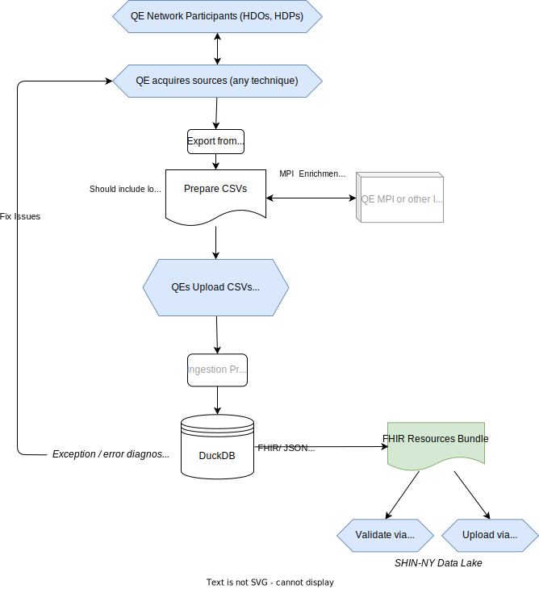

# QCS Orchestration Engine (QCS-OE) Strategy

The objective of QCS-OE is to get from ingestable content in CSV, Excel, and
similar formats into a SQL-queryable analyst-friendly format as quickly as
possible. Once content is SQL-queryable and analyst-friendly it can be
anonymized, enriched, cleansed, validated, transformed, and pushed to other
formats such as FHIR (JSON).

To facilitate quickly getting ingestable content into a SQL-queryable
analyst-friendly format, QCS-OE employs the following architecture strategy:

- SQL-native encourages performing work inside a DuckDB database as early as
  possible in the ingestion process but all orchestrated resources can be
  exported into SQLite, MySQL, PostgreSQL (bare metal or serverless like RDS),
  AWS Cloud, Azure Cloud, or other databases for portability.
- A TypeScript type-safe Runtime (Deno) is used to drive the DuckDB SQL and uses
  OS-specific execution of DuckDB Shell (CLI) for parallelization and
  scalability.
- Flexible support for local, edge, server, cloud or hybrid models. No code
  changes should be required regardless of which deployment model is chosen.
  - _Local_ allows development on a laptop or any Windows, MacOS, or Linux
    desktop
  - _Edge_ allows services to run within a QE for parts or all of the
    functionality
  - _Server_ allows services to run partially or entirely at a QCS facility in
    case a QE does not want or have the capability to run services _locally_ or
    on the _edge_.
  - _Cloud_ allows services to run partially or entirely in a public or private
    cloud provider (e.g. AWS, Azure, ORACLE Cloud).
- Automatic upgrades of code using `semver` and GitHub tags.

## Runtime (Deployment) Dependencies

#### Quick start (Windows):

If you have a relatively modern Windows 10/11 system with `winget` you can use
the following to install Git, Deno, DuckDB and SQLite:

```psh
$ winget install Git.Git deno SQLite.SQLite DuckDB.cli JanDeDobbeleer.OhMyPosh
# exit your terminal, close VS Code, etc. and restart your terminal session and VS Code
```

#### Quick start (Linux or MacOS):

For Linux or MacOS use `pkgx` or `mise` (or `asdf`) to install your
dependencies.

#### Dependencies References

All dependencies are cross-platform, open source with permissive licenses so
that developers and data analysts do not need to procure or purchase any tools.

- Download
  [Deno](https://docs.deno.com/runtime/manual/getting_started/installation)
  Javascript runtime and put it in your `PATH`.
- Download [DuckDB](https://duckdb.org/docs/installation) 0.9+ for data
  orchestration operations and put it in your `PATH`.
- Download [SQLite](https://www.sqlite.org/download.html) embedded database and
  put it in your `PATH`.
- Download [SQLPage](https://github.com/lovasoa/SQLpage/releases) SQL browser
  and put it in your `PATH`. This is not strictly required but highly
  recommended for easier diagnostics. See _Manage GitHub binaries with `eget`_
  for an easy way to manage GitHub binaries.

The utilities mentioned above are cross-platform single-file binaries and will
run on Windows, MacOS, or Linux. Please be sure to get the proper binaries for
your platform.

You can run `deno task doctor` (see below) to see if dependencies are installed
properly.

### Manage GitHub binaries with `eget`

A good way to get binaries from GitHub (e.g. SQLPage, et. al.) you should
download and use [eget](https://github.com/zyedidia/eget/releases).

1. Create a directory called `D:\bin` (or anywhere you want), grab the
   `eget.exe` binary and store it in `D:\bin`.
2. Add `D:\bin` to your `PATH`.
3. Create an `D:\bin\eget.toml` file and add the following to it:

```toml
[global]
target = "D:\\bin"

["lovasoa/SQLpage"]
```

4. CD into `D:\bin` and run `eget /D` to download all required binaries.

## Build (Development) Dependencies

During build (development) in a sandbox you will need all the runtime
dependencies mentioned above plus do the following:

- Download [Visual Studio Code](https://code.visualstudio.com/download) IDE and
  use it for editing or viewing of CSV and other assets. VS Code is available
  for all major OS platforms.

You can run `deno task doctor` (see below) to see if dependencies are installed
properly.

## Try out the code

Once you've installed Git and Deno you can run the code directly from GitHub
(the latest version or any specific pinned version) without cloning the GitHub
repo or clone the repo and run the code locally.

The instructions below assume `D:\workspaces` as your workspaces root but you
should change that to `D:\` or `/home/user/workspaces` or whatever your
workspaces root happens to be (based on your operating system).

```bash
$ cd D:\workspaces                        # or wherever your sources are stored
$ deno run -A https://raw.githubusercontent.com/qe-collaborative-services/workspaces/main/ws-bootstrap-typical.ts

# after repo cloning command (above) is complete:
$ cd github.com/qe-collaborative-services/1115-hub
$ deno task                               # list available tasks in `deno.jsonc`
$ deno task doctor                        # see if dependencies are installed properly
$ deno task ahc-hrsn-screening-test-e2e   # run the orchestration tasks as end-to-end test
$ deno task ahc-hrsn-screening-test-serve # run the orchestration tasks as end-to-end test and serve with SQLPage
$ deno task ahc-hrsn-screening-doc        # generate documentation for the library in support/docs/lib/ahc-hrsn-elt/screening
```

## Architecture and Approach

This code allows multiple operating models, but these two are the most likely
use cases:

- QCS Only Model where a QE does not operate their own code instances to
  validate or manage data and relies on QCS infrastructure only.
  - Benefits: No local infrastructure required
  - Detriments: No ability to validate or analyze aggregated data before sending
    to QCS environment
- QE/QCS Model where a QE can operate their own code instances for validation
  and data management locally and then forwards processed data to the QCS
  infrastructure.
  - Benefits: Ability to validate and analyze aggregated data before sending to
    QCS environment
  - Detriments: Needs small amount of local infrastructure to operate the same
    code running at QCS

### Serverless Execution

All of the components of this repo should be able to run in a Serverless
environment like AWS Lamba. See:

- [serverless-duckdb](https://github.com/tobilg/serverless-duckdb) and
- [SQLpage serverless](https://github.com/lovasoa/SQLpage?tab=readme-ov-file#serverless).

### QCS Only Model



### QE/QCS Model


